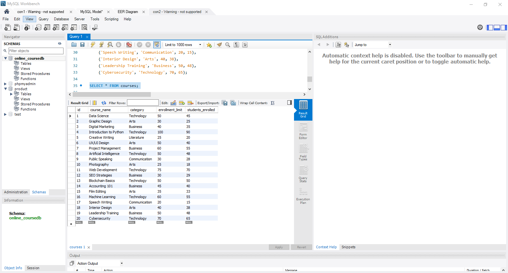
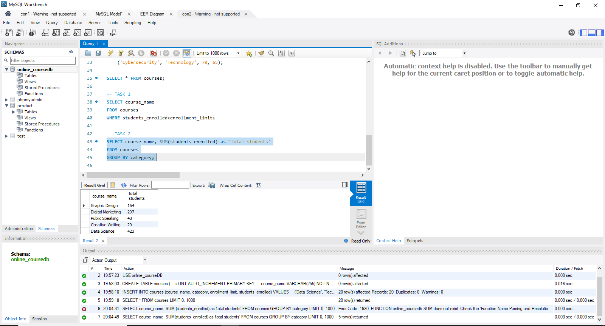
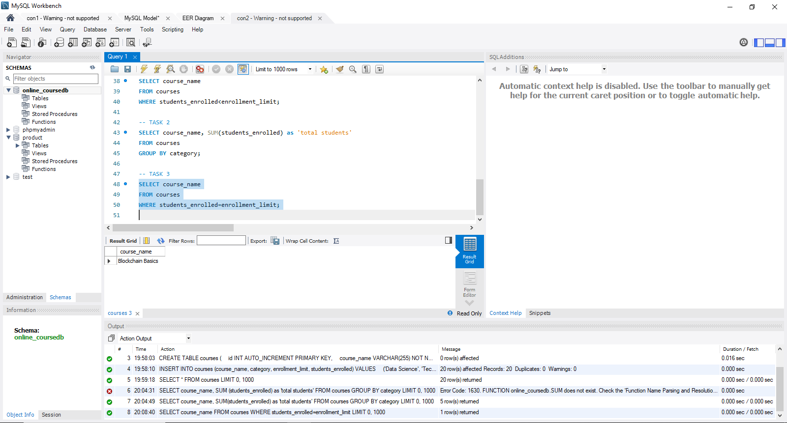
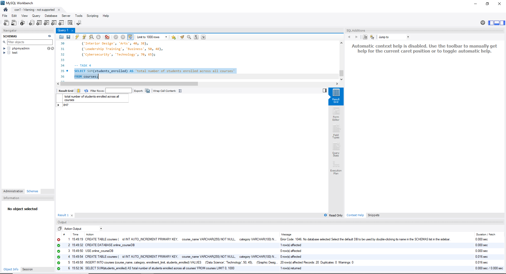
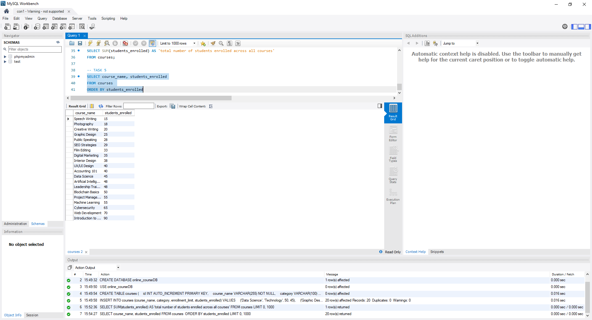

# Finals Lab Task 4 - Using SELECT Clause
In this lab activity, I worked with the SELECT clause in MySQL to retrieve and analyze data from a table named courses in the online_courseDB database. This task focused on using SELECT, WHERE, GROUP BY, ORDER BY, and aggregate functions like SUM() to extract meaningful information from the dataset.

Here are the steps I followed:
- Created a new database
  - Used CREATE DATABASE online_courseDB to make the database.
  - Used USE online_courseDB to select the database.
- Performed SELECT operations
  - Retrieved all courses where students_enrolled is less than enrollment_limit using the WHERE clause.
  - Grouped the courses by category and used SUM(students_enrolled) to get the total per category.
  - Selected courses that are fully enrolled using WHERE students_enrolled = enrollment_limit.
  - Used the SUM() function to get the total number of students enrolled across all courses.
  - Sorted the courses in ascending order by the number of students enrolled using ORDER BY.
- Checked the output
  - Used SELECT statements to display the correct output for each task.
  - Verified that the queries returned the correct data from the courses table. 
## Here's the screenshot of my output for Task 1 (See screenshot)

## Here's the screenshot of my output for Task 2 (See screenshot)

## Here's the screenshot of my output for the Task 3 (See screenshot)

## Here's the screenshot of my output for the Task 4 (See screenshot)

## Here's the screenshot of my output for the Task 5 (See screenshot)

